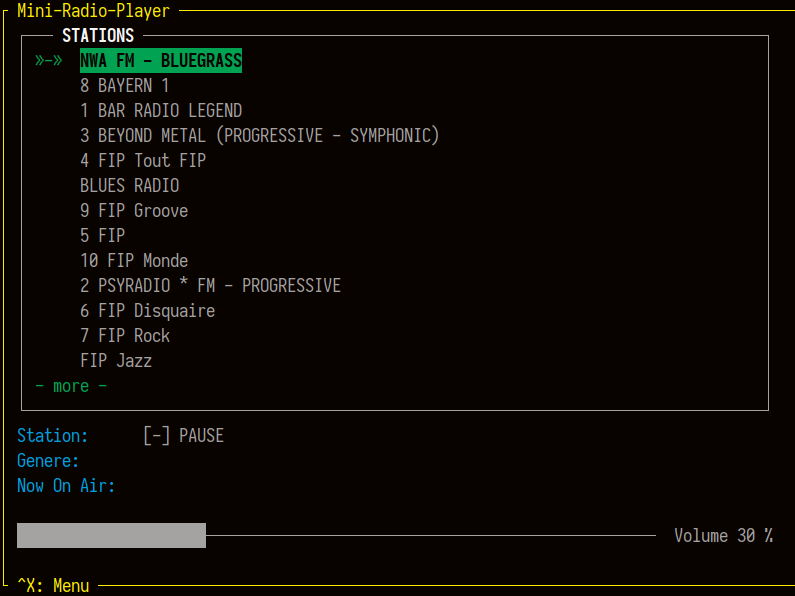

# mini-radio-player-npyscreeen
Python Mini Radio Player with npyscreen




```bash
mkdir projects
cd projects
git clone https://github.com/wdog/mini-radio-player-npyscreeen.git
cd mini-radio-player-npyscreeen
python3 -m venv venv
source venv/bin/activate
pip3 install -r requirements.txt
./r.py
```


# TEMP FIX [ RuntimeError: generator raised StopIteration ]

Only While waiting for npyscreen to release a fix, if you have python >= 3.7  

EDIT:

`mini-radio-player-npyscreen/venv/lib/python3.8/site-packages/npyscreen/apNPSApplicationEvents.py`

and changand change 

```
 def get(self, maximum=None):
        if maximum is None:
            maximum = -1
        counter = 1
        while counter != maximum:
            try:
                yield self.interal_queue.pop()
            except IndexError:

                return

            counter += 1
```

